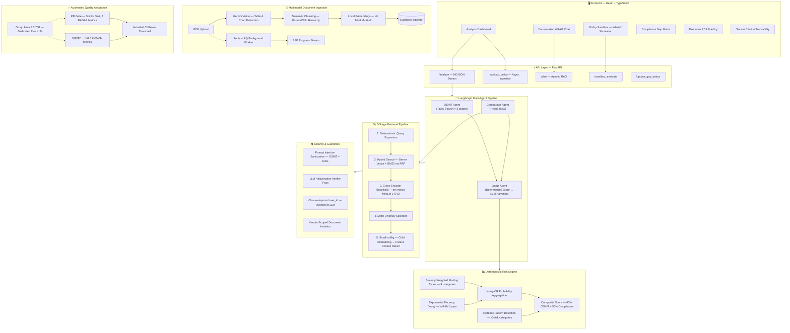

# 🛡️ Trust Agent — Autonomous Vendor Due Diligence Platform

**🌐 Live Demo:** [https://trust-agent-five.vercel.app/](https://trust-agent-five.vercel.app/)


An autonomous AI platform that replaces weeks of manual vendor security reviews with a multi-agent system that gathers live threat intelligence, cross-references vendor policies against internal standards, and produces auditable, source-cited risk scorecards — with a deterministic scoring engine that prevents the LLM from hallucinating risk levels.

---

## 🏗️ System Architecture



---

## 🧠 Why This Isn't Another "Chat With Your PDF" Project

Most RAG portfolio projects wrap a single retrieval call in a chatbot UI. Trust Agent is a **multi-agent system** with a **5-stage retrieval pipeline**, a **deterministic scoring engine**, and **production-grade security hardening**. Here's what makes it different:

### The LLM doesn't decide the risk level — math does.

LLMs are terrible calibrated judges. Feed them scary headlines and they'll say "CRITICAL" every time. Trust Agent computes risk scores deterministically using severity weighting, exponential recency decay, and noisy-OR probability aggregation across 9 finding categories. The LLM's job is narrowed to *explaining* a score it cannot override — making the output auditable, testable, and free from an entire class of hallucination.

### Retrieval is a 5-stage pipeline, not a single similarity search.

1. **Deterministic query expansion** — static cybersecurity vocabulary mapping (SOC 2, AES-256, RBAC, MFA, zero trust...) instead of burning an LLM call on synonym generation
2. **Hybrid search** — dense vector similarity + BM25 keyword matching, fused via Reciprocal Rank Fusion (Supabase RPC)
3. **Cross-encoder reranking** — `ms-marco-MiniLM-L-6-v2` re-scores top-K with full cross-attention, catching semantic matches that bi-encoders miss
4. **MMR diversity selection** — prevents the top-K from being 5 paraphrases of the same clause
5. **Small-to-big retrieval** — child chunks are embedded and searched (high precision), parent chunks are returned to the LLM (full context)

### Every claim in the UI traces back to its source.

OSINT inferences link to the original article URL with finding-type badges and relevance scores. RAG inferences show the exact policy chunk that was retrieved, tagged with its source document and role. This isn't "trust me" AI — it's verifiable AI.

### Untrusted content is sanitized before it reaches any LLM prompt.

Web-scraped OSINT results and vendor-uploaded PDFs are both indirect prompt injection vectors. A shared sanitization layer scans for injection patterns across both surfaces before any content enters an LLM context window.

### The authorization boundary isn't a prompt instruction — it's a closure.

The chat agent's document search tool needs a `user_id` to scope retrieval. Instead of passing it as a tool parameter the LLM generates (and could hallucinate or be manipulated into changing), `user_id` is injected via Python closure at graph construction time — the model physically cannot see or alter it.

---

## ✨ Feature Set

### Core Analysis
- **Multi-Agent LangGraph Pipeline** — OSINT, Comparator, and Judge agents with typed state, reducer-based accumulation, and conditional edges
- **Real-Time OSINT** — Tavily search across 3 risk angles (breach/security, regulatory/GDPR, privacy/controversy) with 9-category keyword classification
- **Deterministic Risk Scoring** — Severity-weighted, recency-decayed, noisy-OR aggregated composite score with systemic pattern detection
- **Multimodal PDF Ingestion** — Gemini Vision extracts tables, charts, and diagrams from policy PDFs during ingestion

### Interactive Tools
- **Policy Sandbox** — Toggle internal policy requirements on/off and simulate the impact on the vendor's risk score in real time
- **Compliance Gap Matrix** — Track every finding's resolution status (Accept Risk / Remediate / Exempt), assign to team members, add internal notes
- **Conversational RAG Chat** — LangGraph-based agentic chat with tool-calling; retrieves fresh policy chunks on demand when the cached context isn't sufficient
- **Remediation Email Generator** — One-click professional email draft addressed to the vendor's security team, citing specific discrepancies
- **Executive PDF Export** — CISO-ready briefing with risk dial visualization, compliance gap resolution progress, and recommendation tier
- **Live Threat Intelligence** — Proactive vendor watchlist with real-time threat alerts for monitored vendors

### Production Hardening
- **Prompt Injection Sanitization** — Shared regex-based scanner on all untrusted content (OSINT + vendor PDFs) before LLM ingestion
- **Closure-Injected Auth Scoping** — `user_id` baked into tool closures server-side, invisible to the LLM
- **Vendor-Scoped Document Isolation** — Documents tagged with `vendor_name` in metadata; uploading Vendor B never corrupts Vendor A's stored chunks
- **Persistent Chat Memory** — PostgreSQL-backed LangGraph checkpointer (via Supabase) survives container restarts
- **Async Ingestion** — Redis + RQ background workers with SSE progress streaming to the frontend
- **Audit Deduplication & Versioning** — Identical raw-findings fingerprinting prevents duplicate audits; changed findings auto-version (`Vendor (v2)`)
- **OpenTelemetry Instrumentation** — FastAPI auto-instrumented for distributed tracing

### Quality Assurance
- **Tiered RAGAS Evaluation** — Smoke test (2 metrics, every PR) + Nightly (4 metrics including context precision/recall)
- **Dedicated Eval LLM** — Groq Llama 3.3 70B for evaluation, completely isolated from production Gemini quota
- **CI Quality Gates** — GitHub Actions auto-fails PRs that drop below faithfulness/relevancy thresholds

---

## 🛠️ Tech Stack

| Layer | Technology | Why |
|---|---|---|
| Orchestration | LangGraph | Typed state with reducers, conditional routing, checkpointed memory |
| LLM (Production) | Google Gemini 2.5 Flash | Structured output, multimodal vision, free tier |
| LLM (Evaluation) | Groq Llama 3.3 70B | 14,400 calls/day free — never competes with production quota |
| Embeddings | all-MiniLM-L6-v2 (local) | Zero-cost, normalized, CPU-bound — proprietary docs never leave the server |
| Reranker | cross-encoder/ms-marco-MiniLM-L-6-v2 | Full cross-attention reranking, pre-cached in Docker image |
| Vector Store | Supabase pgvector + hybrid RPC | Dense + BM25 in a single RPC call with RRF fusion |
| OSINT | Tavily Search API | Structured web search with metadata (dates, URLs) |
| Backend | FastAPI, Redis, RQ | Async API + background job processing |
| Frontend | React 18, TypeScript, Vite, Tailwind | Real-time SSE streaming, modular component architecture |
| Eval | RAGAS | Faithfulness, answer relevancy, context precision, context recall |
| CI/CD | GitHub Actions | PR quality gate + nightly eval + auto-deploy to HF Spaces |
| Observability | OpenTelemetry | Auto-instrumented FastAPI tracing |

---

## 📂 Project Structure

```
backend/
├── api.py                  # FastAPI — all endpoints, SSE streaming, auth, CORS
├── main.py                 # LangGraph graph compilation and wiring
├── state.py                # Typed pipeline state with reducer annotations
│
├── osint_agent.py           # OSINT agent — Tavily search, 9-category classifier, relevance scorer
├── comparator_agent.py      # Comparator agent — 5-stage retrieval, cross-encoder, MMR, policy comparison
├── judge_agent.py           # Judge agent — deterministic scoring anchor + LLM narration
├── risk_scoring.py          # Deterministic risk engine (severity, recency decay, noisy-OR, composite)
├── chat_agent.py            # Conversational RAG — LangGraph tool-calling with persistent memory
│
├── ingest.py                # Multimodal ingestion — PDF → Gemini Vision → semantic chunks → embeddings
├── ingest_worker.py         # Redis/RQ background worker
├── sanitization.py          # Shared prompt injection detection (OSINT + RAG)
│
├── eval_pipeline.py         # Tiered RAGAS evaluation with quality gates
├── tests/
│   └── nightly_eval_dataset.jsonl   # 5-case eval dataset
│
├── Dockerfile               # Production container with pre-cached embedding + reranker models
├── requirements.txt
└── start.sh                 # Entrypoint: Redis + RQ worker + Uvicorn

frontend/
├── src/
│   ├── components/
│   │   ├── Results.tsx            # Main dashboard with source-cited inference panels
│   │   ├── SourceEvidence.tsx     # Expandable source attribution (OSINT URLs + RAG clauses)
│   │   ├── GapMatrix.tsx          # Interactive compliance gap tracking with team assignment
│   │   ├── PolicySandbox.tsx      # What-if policy simulation with live risk recalculation
│   │   └── ExecutiveReport.tsx    # PDF export with risk dial and resolution progress
│   ├── types.ts                   # Shared TypeScript interfaces
│   └── api.ts                     # API client with auth token management

.github/workflows/
├── rag-eval-smoke.yml       # PR quality gate — 2 RAGAS metrics via Groq
├── rag-eval-nightly.yml     # Nightly full eval — 4 RAGAS metrics
└── deploy-backend.yml       # Auto-deploy backend to HF Spaces via git subtree
```

---

## 🚀 Deployment

| Component | Platform | Method |
|---|---|---|
| Backend | Hugging Face Spaces | Dockerized, auto-deployed via `git subtree split` on push to `main` |
| Frontend | Vercel | Continuous deployment from `frontend/` |
| Database | Supabase | Serverless PostgreSQL with pgvector, RLS-enforced tenant isolation |
| Eval | GitHub Actions | Smoke on PR, nightly full suite, auto-fail below threshold |

---

## 🔒 Security & Privacy

Trust Agent is built with zero-trust principles:

- **Zero-trust embedding** — All document embeddings are generated locally on CPU. Proprietary internal security policies never leave the server to reach a third-party embedding API.
- **Prompt injection defense** — A shared sanitization layer scans both web-scraped OSINT content and vendor-uploaded PDF text for injection patterns before any content enters an LLM context window.
- **Authorization via closure, not prompt** — The chat agent's retrieval tool has `user_id` injected via Python closure at graph construction time. The LLM cannot see, alter, or hallucinate the access-control parameter.
- **Vendor-scoped document isolation** — Documents are tagged with `vendor_name` in metadata. Uploading a new vendor's policy never overwrites or corrupts a different vendor's stored chunks.
- **Tenant isolation** — Supabase Row-Level Security (RLS) enforces strict per-user data boundaries at the database level.

---

## 🧪 Running Locally

```bash
# Backend
cd backend
python -m venv venv && source venv/bin/activate
pip install -r requirements.txt
redis-server --daemonize yes
python ingest_worker.py &
uvicorn api:app --reload --port 8080

# Frontend (separate terminal)
cd frontend
npm install && npm run dev
```

**Required environment variables** (`.env` in `backend/`):
```env
GOOGLE_API_KEY=         # Gemini 2.5 Flash — production LLM
TAVILY_API_KEY=         # OSINT web search
SUPABASE_URL=           # Supabase project URL
SUPABASE_KEY=           # Supabase anon/service key
SUPABASE_DB_URL=        # Direct Postgres connection (for persistent chat memory)
GROQ_API_KEY=           # Groq — dedicated eval LLM (not used in production)
```

---

## 📊 Evaluation

```bash
# Fast smoke test — 2 metrics, ~5 seconds via Groq
python eval_pipeline.py --tier smoke

# Full nightly eval — 4 metrics including retrieval quality
python eval_pipeline.py --tier nightly
```

| Metric | What It Measures | Tier |
|---|---|---|
| Faithfulness | Are generated claims supported by retrieved context? | Smoke + Nightly |
| Answer Relevancy | Does the response actually address the question? | Smoke + Nightly |
| Context Precision | Are the retrieved chunks relevant to the query? | Nightly only |
| Context Recall | Did retrieval find all the information needed? | Nightly only |

CI auto-fails PRs that drop below baseline thresholds — regressions are caught before deployment, not in production.